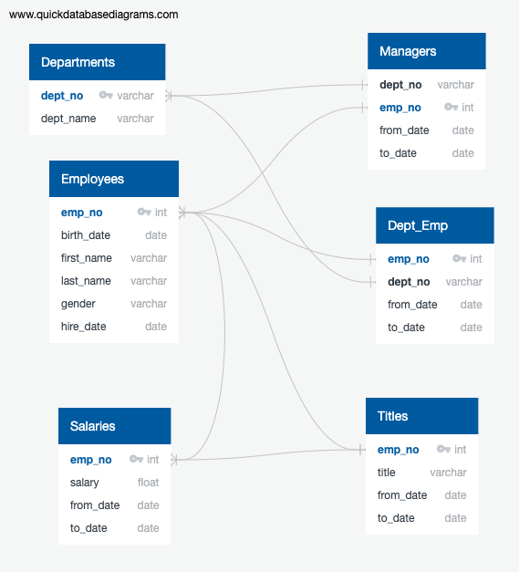
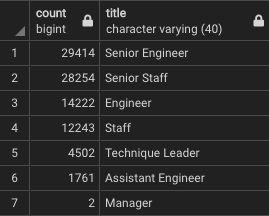
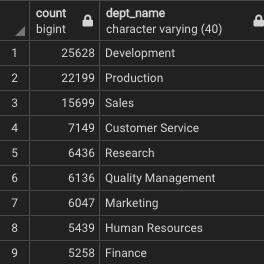
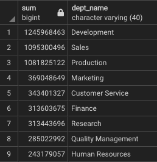

# Pewlett Hackard Analysis
 Employee database review with PostgreSQL

## Overview
The framework of this project was to examine the personnel rosters for a large corporation (Pewlett Hackard) with an eye towards soon-to-retire employees, and specifically how the Sales and Development teams would be effected.

The starting input for the project were six CSV files. Their column headers and relationships are diagrammed in the ERD (Entity Relationship Diagram) shown above. Once relationships were mapped, databases were created, linked through keys, and the data from the CSVs were imported. Once this was done we were able to begin making queries and isolating useful chunks of information. These query results were then, in turn, exported into their own discrete CSV files for later review.

Early stage inquiries involved collecting lists of PH employees who where were "of retirement age," department managers, and potential retirees from select departments. The end-of-project Challenge section focused on creating two primary query results:
- a summary of the number of retiring employees by their current job title;
- a list of all employees eligible for a mentorship program designed for retiring staff.

## Results
The queries constructed in this project indicated that there truly is a "silver tsunami" coming down the pipes for Pewlett Hackard.

- A total of 90,398 employees are about to retire from the company.
- The bulk of the retiring employees are "Senior Engineers" (33%) or "Senior Staff" (31%), indicating the departure of a significant portion of experiential knowledge. Recruiting will need to work hard to counter this brain-drain.
- Fortunately only two managers are retiring, minimizing need to train new leadership.
- The number of employees eligible for the mentorship program are few (1549) in comparison to the number of employees retiring.

## Summary
According to the analysis of the data provided in the CSV files, there may be as many as 90,398 employees retiring within the next year. This is an extraordinarily large number of vacancies to fill. However, PH may be able to save some time and money in the long run by conducting a review of roles and positions. Some positions may be phased out, unnecessary projects should be terminated (along with the roles associated with them), and some responsibilities may be able to be transferred to existing staff. Before such a study is conducted, it's hard to say exactly how many roles will need to be filled.

There are over 1500 "qualified, retirement-ready employees" for the mentorship program. However, without knowing how many locations these employees are spread over, it's hard to begin to design such a project. Location information was, unfortunately, not included in the original CSVs. Assuming even distribution across all offices and departments:
- If PH attempted to fill all vacancies, there would be a 58:1 trainee to mentor ratio
- If PH attempted to only fill 60% of the vacancies, it could reduce the trainee-to-mentor ratio to 35:1.

Two additional tables that could prove useful in preparing for the coming "Silver Tsunami" are as follows:

- A table showing how many employees are retiring by department, which indicates that Development and Production teams are going to see the biggest losses.

- A table showing the total salaries of all the retiring employees. The grand total is in the billions. As long as PH spends less than this on hiring replacements, it's saved money.
